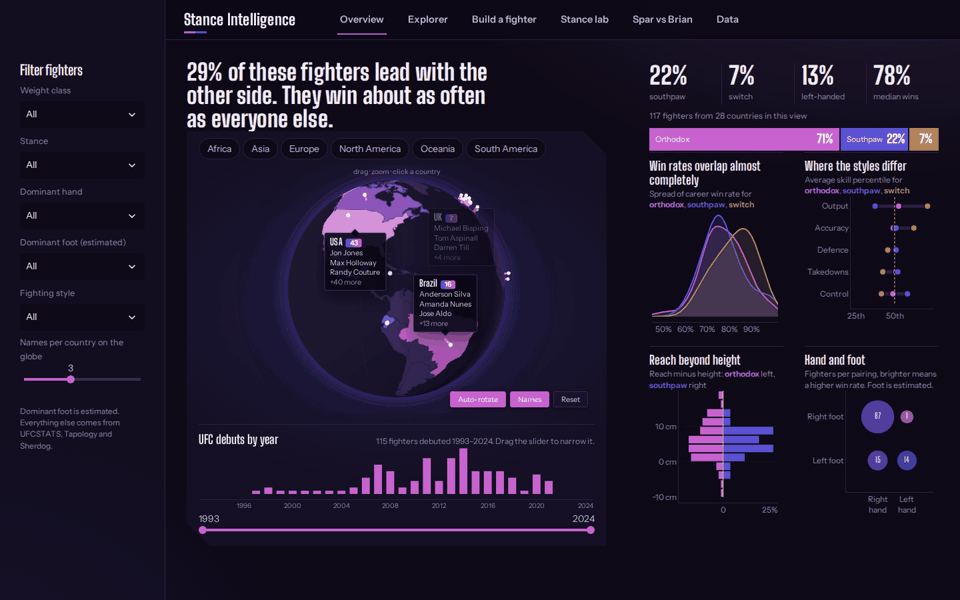
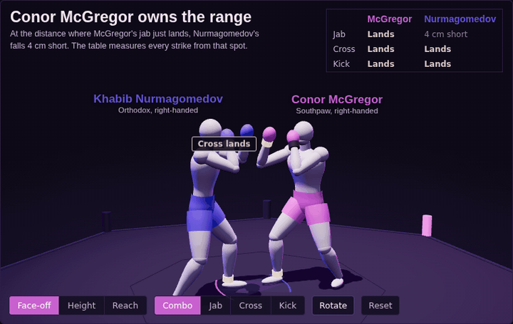
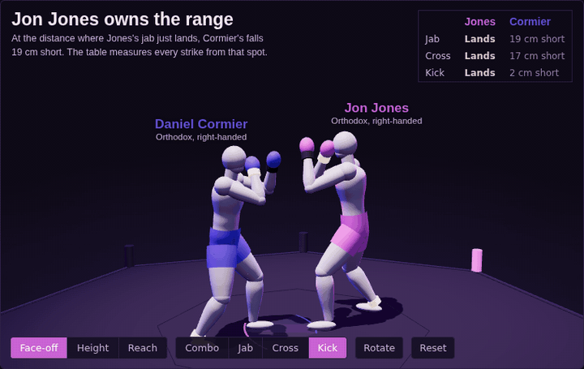
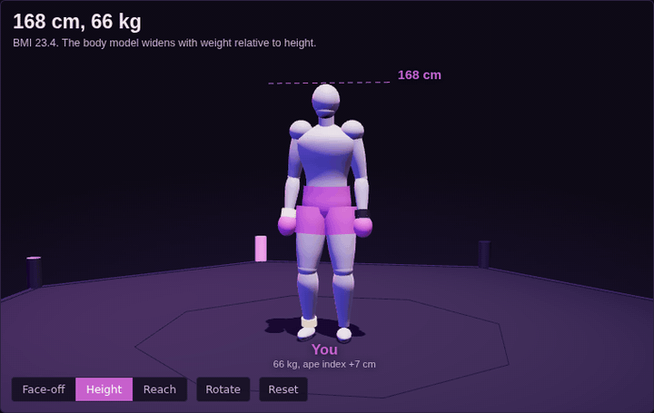
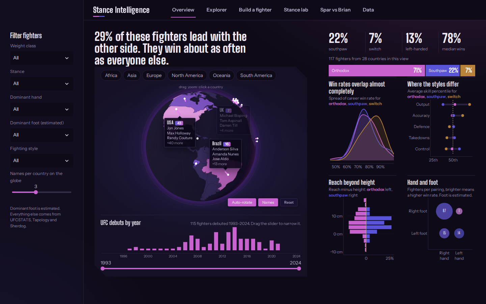
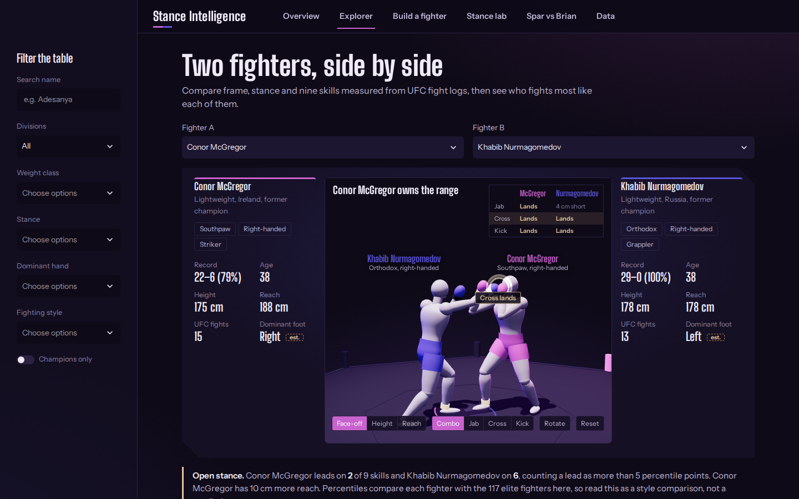
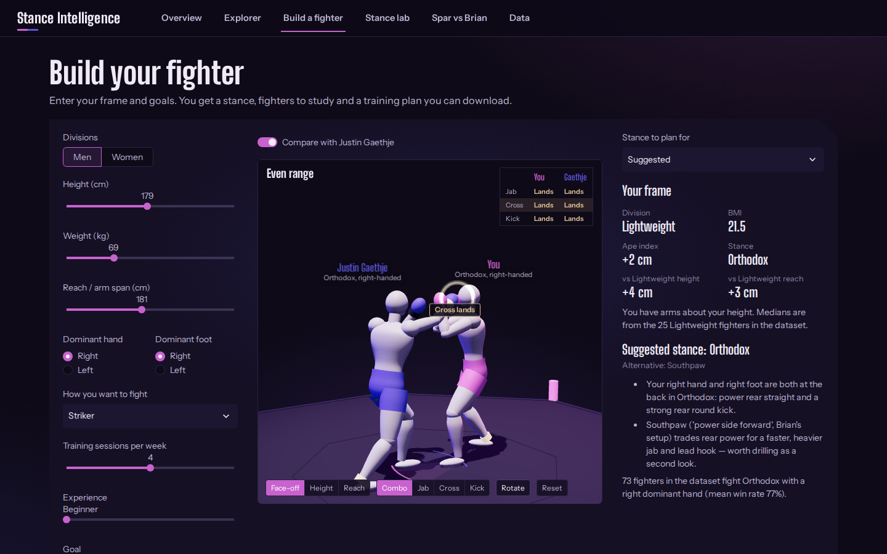
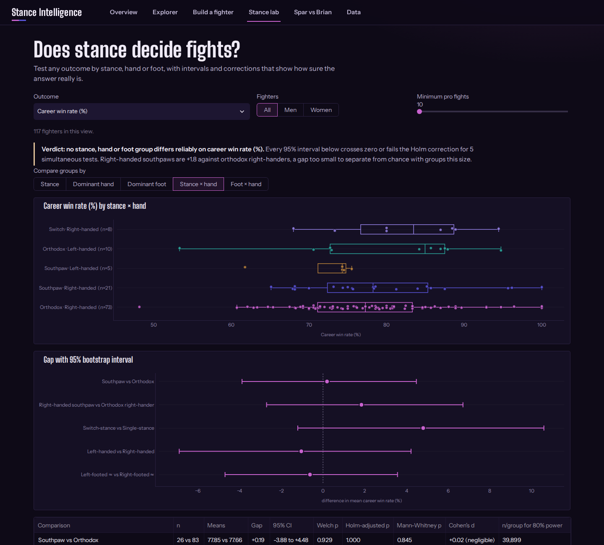
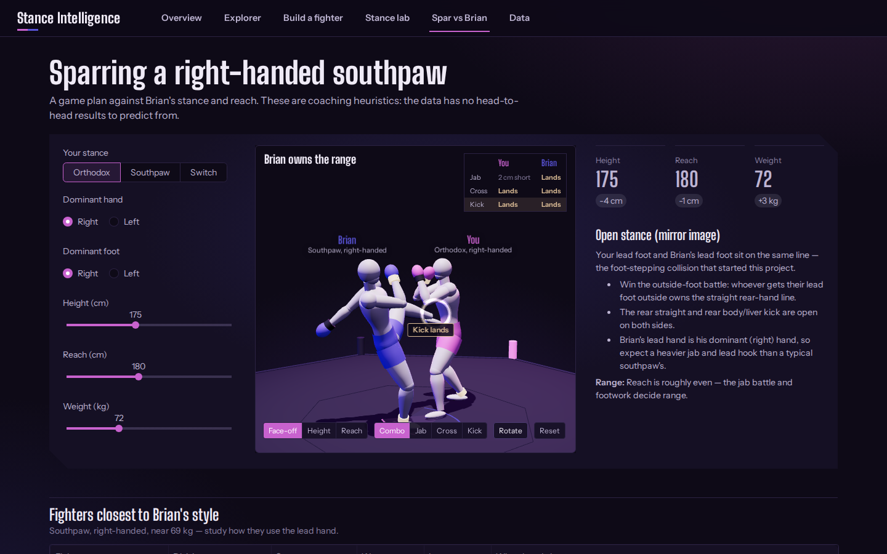

# UFC Stance & Handedness Intelligence
*An end-to-end data project that started on the sparring mats at UFC Gym Townhall, Sydney.*

[](https://ufcstanceandhandednessintelligence-qsdqucvqpj5hhwymhqbeji.streamlit.app)
[](https://public.tableau.com/app/profile/brian.ma5935/viz/UFCRECOMENDATIONENGINE/Dashboard1)
[](https://www.kaggle.com/brianphu)
[](https://github.com/brianphu2310/UFC_STANCE_AND_HANDEDNESS_INTELLIGENCE/actions/workflows/tests.yml)



## The question

I train kickboxing and Muay Thai. One session I stepped on my partner's foot mid-combination —
we were in mirror-image stances and our footwork collided. I'm a **right-handed southpaw**: my
dominant hand is my *lead* hand, so my jab is my best weapon, not the rear straight most
southpaws are known for.

That raised a testable question: **does stance — or the hand behind it — change who wins at the
top level?**

## What the data says

117 elite fighters from 28 countries, official UFCSTATS stance, pro record and UFC fight-log stats.

| Comparison | n | Mean win rate | Gap (95% CI) | Welch p | Holm p | Cohen's d |
|---|---|---|---|---|---|---|
| Southpaw vs orthodox | 26 vs 83 | 77.9% vs 77.7% | +0.2 (−3.9 to +4.5) | 0.93 | 1.00 | 0.02 |
| Right-handed southpaw vs orthodox right-hander | 21 vs 73 | 79.2% vs 77.4% | +1.8 (−2.7 to +6.7) | 0.45 | 1.00 | 0.19 |
| Switch-stance vs single-stance | 8 vs 109 | 82.5% vs 77.7% | +4.8 (−1.2 to +10.6) | 0.18 | 0.71 | 0.50 |
| Left-handed vs right-handed | 15 vs 102 | 77.1% vs 78.2% | −1.0 (−6.9 to +4.2) | 0.73 | 1.00 | −0.11 |

**No stance or handedness group wins reliably more often.** Every interval crosses zero, and none
survives a Holm correction for running several tests at once. Switch-hitters show the largest
gap, but with 8 fighters a 5-point edge can't be told apart from chance — a real test would need
about 60 fighters per group.

Where stance *does* show up is in **how** people fight (Stance lab and Explorer pages): the skill
profiles, reach distributions and striking-vs-grappling mix differ by stance, even though the
win rates don't.

> Earlier versions of this README reported a 74.3% vs 70.2% "right-handed southpaw advantage"
> (d = 0.43). Re-checking against the official UFCSTATS stance showed that **43 of 117 fighters had
> the wrong stance** in the original spreadsheet, and the corrected data shows no such advantage.
> The app lists every correction on its Data page.

## See it move

The 3D face-off sets the fighters at the distance where the longer jab just lands, then throws a
jab, cross and rear roundhouse kick from that same spot. Every strike either stops on contact or
fully extends and comes up short, so the table in the corner is a real measurement of each frame.

| Face-off combo | Jones vs Cormier: 30 cm of reach |
|---|---|
|  |  |

**Build a fighter:** the body model reshapes as height, weight and reach change, and switches stance on the spot.



## The app

| Page | What it does |
|---|---|
| **Overview** | One-screen dashboard: rotatable 3D globe with fighter names on each country, continent picker, debut-year timeline with slider, and six different charts on stance, hand and foot |
| **Explorer** | Pick any two fighters: tale of the tape, a 3D face-off in the octagon (jab, cross and kick thrown from real range, plus height and reach overlays), skill-percentile butterfly chart, stance geometry, and the five fighters who fight most like them. Filterable table with CSV export |
| **Build a fighter** | Enter height, weight, reach, dominant hand and foot, style, training frequency and goal → rotatable 3D body model, stance advice, fighters to study (with what to learn from their real stats), a phased roadmap, weekly schedule, classes and coaches. Downloadable plan |
| **Stance lab** | Welch t-test, Mann-Whitney, Cohen's d, bootstrap intervals, Holm correction and power analysis for any outcome and grouping |
| **Spar vs Brian** | Open vs closed stance game plan against a right-handed southpaw, with both fighters sparring in 3D |
| **Data** | Where every column comes from, the 43 stance corrections, and limitations |

<table><tr><td colspan="2"></td></tr><tr>
<td></td>
<td></td>
</tr><tr>
<td></td>
<td></td>
</tr></table>

## Data

| Source | Used for |
|---|---|
| Project spreadsheet (`UFC_FINAL_DATASET.xlsx`) | Fighter list, full pro record, dominant hand, nationality |
| [UFCSTATS](http://ufcstats.com) via the public [Greco1899/scrape_ufc_stats](https://github.com/Greco1899/scrape_ufc_stats) dump | Official stance, height, reach, date of birth, round-by-round fight stats |
| Derived | Strike accuracy/defence, output, damage absorbed, takedowns, control time, fighting style, popularity index |
| Estimated | **Dominant foot only** — no public source records it; clearly marked "≈" / "EST" everywhere |

Every column's source is listed in `data/data_dictionary.csv`. Coaches and classes on the
Build-a-fighter page are a fictional sample catalogue you can replace with a real gym's roster.

## Run it

```bash
pip install -r requirements.txt
streamlit run ufc_intelligence_app.py
```

Rebuild the data (downloads the UFCSTATS dump on first run):

```bash
pip install -r requirements-dev.txt
python scripts/build_clean_dataset.py
python scripts/enrich_dataset.py
```

Tests (data quality, statistics, recommender, and a smoke test of every page):

```bash
pytest -q
```

## Project structure

```
ufc_intelligence_app.py     entry point, top-bar navigation
ufc_core.py                 statistics, recommender, roadmap (no Streamlit — unit-tested)
ui.py                       theme, chart defaults, shared HTML pieces
views/                      one module per page
components/globe3d/         three.js globe (bundled locally, no CDN)
components/body3d/          three.js parametric body model
scripts/                    build_clean_dataset.py → enrich_dataset.py
data/                       cleaned + enriched dataset, data dictionary, sample catalogues
tests/                      pytest suite incl. Streamlit AppTest page smoke tests
notebooks (*.ipynb)         original scraping, cleaning and visualisation work
legacy/                     first-version scripts kept for reference
```

## Limitations

- **Sample:** 117 well-known fighters, mostly winners — win rates are compressed and small
  groups (5–21 fighters) give wide intervals.
- **Dominant hand** comes from the project spreadsheet and is not independently verified.
- **UFC-only stats** — fighters with little UFC time (e.g. Fedor) have no fight-log stats.
- The Tableau dashboard and Colab notebook predate the stance corrections.

## About

**Brian Phu** — data analyst and southpaw kickboxer, Sydney.
[LinkedIn](https://www.linkedin.com/in/brian-phu-data-analysta55353390/) ·
[GitHub](https://github.com/brianphu2310) ·
[Kaggle](https://www.kaggle.com/brianphu) ·
[Tableau](https://public.tableau.com/app/profile/brian.ma5935/vizzes)

MIT License.
