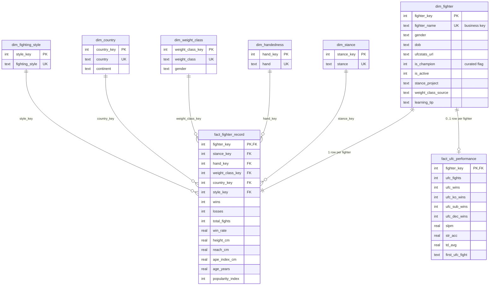

# Data model

The warehouse is a small star schema in SQLite (`warehouse.db`, git-ignored, rebuilt by
`python -m pipeline.run`). DDL: [`pipeline/schema.sql`](../pipeline/schema.sql). Source of truth for
the loaded data: `data/ufc_fighters_enriched.csv` (117 rows, 62 columns).

## Entity-relationship diagram

`fact_ufc_performance` has 31 columns; the diagram shows a subset (full list in the DDL).
`etl_load_audit` (table name, row count, source file) records what the last load wrote, and the view
`vw_fighter_profile` joins the record fact to all its dimensions for ad-hoc queries.

## Grain and keys

| Table | Grain (one row per...) | Primary key | Natural / business key | Foreign keys | Rows |
|---|---|---|---|---|---:|
| `dim_fighter` | fighter | `fighter_key` | `fighter_name` (unique) | none | 117 |
| `dim_stance` | stance (Orthodox, Southpaw, Switch) | `stance_key` | `stance` | none | 3 |
| `dim_handedness` | dominant hand | `hand_key` | `hand` | none | 2 |
| `dim_weight_class` | weight class (and gender) | `weight_class_key` | `weight_class` | none | 12 |
| `dim_country` | country | `country_key` | `country` | none | 28 |
| `dim_fighting_style` | rule-based style label | `style_key` | `fighting_style` | none | 4 |
| `fact_fighter_record` | fighter (career record and physical attributes) | `fighter_key` | | stance, hand, weight class, country, style, fighter | 117 |
| `fact_ufc_performance` | fighter with UFC fight-level stats | `fighter_key` | | fighter | 115 |

- Surrogate keys are integers 1..n assigned in `pipeline/transform.py`, ordered by the normalised
  natural key (it reuses `norm()` from `scripts/build_clean_dataset.py`), so rebuilding from the same CSV
  gives the same keys.
- Both facts are snapshots with one row per fighter, so there is no date dimension; dates
  (`dob`, `first_ufc_fight`, `last_ufc_fight`) are stored as ISO text.
- Measures: wins, losses, total_fights, win_rate, height/reach, age and the UFC rate statistics.
  `win_rate` is stored as a percentage (0-100) and checked against `wins / (wins + losses)`.
- Constraints in the DDL: `NOT NULL`, `UNIQUE` on business keys, `CHECK` on domains and on
  `total_fights = wins + losses`, and enforced foreign keys. A post-load `PRAGMA foreign_key_check`
  must return no rows.
- Indexes: foreign-key columns of `fact_fighter_record`, a composite `(stance_key, hand_key)` index,
  `win_rate`, `first_ufc_fight` and `dim_country.continent`.

## Deliberate exclusions

`foot` and `foot_hand` are **not loaded**. `data/data_dictionary.csv` marks dominant foot as
`estimated`: it is generated by a seeded random rule in `scripts/enrich_dataset.py` and is not an
observation. The warehouse holds only scraped, derived or curated columns.

## Pipeline stages

| Stage | Module | What it does |
|---|---|---|
| Extract | `pipeline/extract.py` | Reads `data/ufc_fighters_enriched.csv` unchanged |
| Validate | `pipeline/validate.py`, `pipeline/report.py` | 38 checks; errors block the load; writes [DATA_QUALITY.md](DATA_QUALITY.md) |
| Transform | `pipeline/transform.py` | Builds dimensions and facts with surrogate keys, drops estimated columns |
| Load | `pipeline/load.py`, `pipeline/schema.sql` | Recreates `warehouse.db` in one transaction, checks foreign keys, runs `ANALYZE` |

Run: `python -m pipeline.run` (add `--no-report` to leave `docs/DATA_QUALITY.md` untouched).
Analysis queries: [`sql/README.md`](../sql/README.md); results in `docs/query_results/`.
